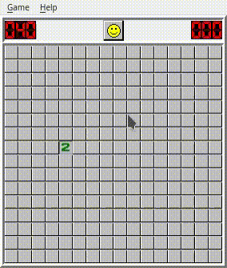
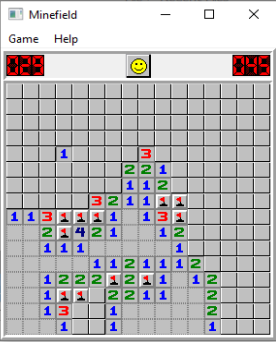
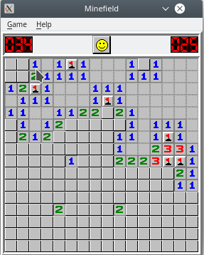

# Minefield

<table>
    <tr>
    <td></td>
    <td></td>
  </tr>
 </table>

## About

* Full featured Cross-platform Minesweeper clone. Tested on Linux and Windows. It should run on Mac too
* Design based on [Windows 95 Version](http://www.minesweeper.info/downloads/Winmine95.html) 
* It was written from scratch using Qt with C++

## Features

* Available difficulties: beginner, intermediate, expert and custom
* The marks can be turned on and off
* The color of the game can be turned on and off
* The highscores are saved

## Dependencies for Running Locally

* Qt >= 5.12 
  * You can download Qt [here](https://www.qt.io/download). The game was developed under Qt Creator

## Request

* If you have a Mac and run it there, maybe you can send me a screenshot to add it to this readme

## License

This project is licensed under the GPL3 License - see the [LICENSE.md](LICENSE.md) file for details
